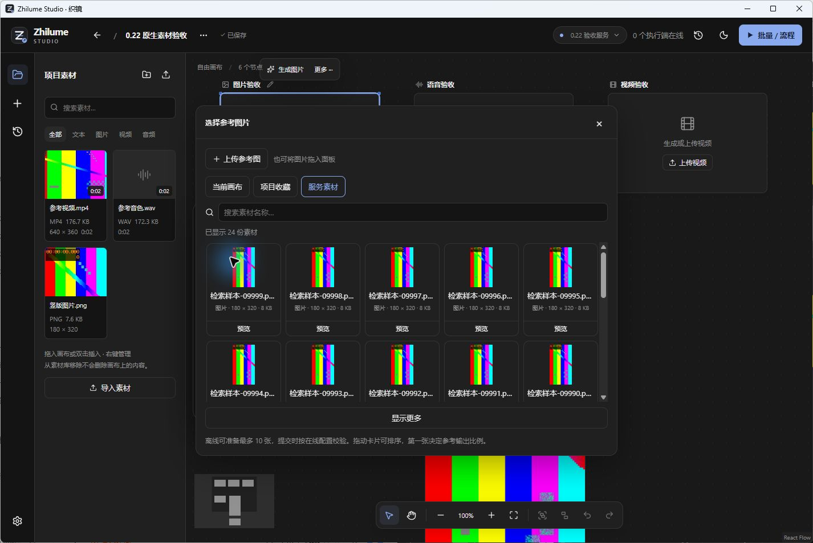

# 素材目录与元信息验收

日期：2026-10-04。版本：Studio 0.22.0 / Server 0.16.0；Worker 0.12.1 未修改。Studio 控制协议升级至 3.2，Worker 协议仍为 3.0。本轮没有运行 GPU 推理。

## 实现范围

- 图片、视频、语音和拼图选材共享“当前画布 / 项目收藏 / 服务素材”来源、服务端名称搜索和游标分页。默认每页 24 条，接口最多 100 条；切换来源和搜索时丢弃过期响应。
- Studio 不再轮询完整服务素材列表，改为按画布内容、草稿、历史中的素材 ID 分批解析；参考选择立即加入工作区缓存，分页与刷新不清除已选引用。
- Server 新增 `POST /assets/query`、`POST /assets/resolve`。SQL 直接过滤素材与收藏记录，排除暂存素材和内部存储路径；游标绑定查询条件，并保持新增上传的翻页边界。
- 新素材入库时探测尺寸和时长并持久化。探测使用本地 FFmpeg，限制并发、时间、输出量与可访问协议；失败时仍保留可使用的素材。目录请求不再逐个探测媒体。
- 视频和音频列表使用类型图标，点击预览才创建播放器；图片缩略图延迟加载。预览与选择分离，切换来源、搜索、选择和关闭会卸载预览播放器。
- 拼图改用同一素材浏览器；浮层通过上下文继承层级，解决素材选择器被拼图对话框遮挡的问题。
- 原生验收发现多行素材卡片被网格压缩，已改为内容行高和顶部对齐，保留列表内部滚动，并增加卡片高度断言。

## 自动化验证

| 范围 | 结果 |
| --- | --- |
| Studio 单元测试 | 19 / 19 通过 |
| Server 测试 | 35 通过，1 个 Linux 专用用例在 Windows 跳过 |
| 浏览器回归 | 49 个不同用例最终全部通过，包含针对失败项的修复后重跑 |
| 最终关联回归 | 13 个编辑区、创作工具、生成和素材浏览用例通过 |
| 最终素材卡片尺寸断言 | 通过；在并行打包负载下首次触及 45 秒总超时，放宽至 90 秒后用例用时约 36.8 秒通过 |
| 打包 | Studio、Server Windows unpacked 构建成功 |
| 打包内容核对 | Studio 最终 dist 三个文件与 ASAR 一致；Server 26 个运行及管理端文件与 ASAR 一致，版本分别为 0.22.0 / 0.16.0 |

首次完整浏览器回归为 46 通过、3 失败。修复了管理端测试的过时提示文案、音频替换按钮的过时居中断言，以及拼图依赖整库缓存的问题。拼图修复后的复测进一步暴露嵌套浮层层级问题，修复后通过。上述结果不代表一次无重试的全套运行。

接口测试覆盖 10,000 条记录分页、来源隔离、名称和收藏别名搜索、并发新增时的翻页边界、无效游标、认证、暂存素材排除、内部字段排除和按 ID 解析上限。测试禁止查询调用 `store.all('asset')`。真实 WAV / MP4 入库测试验证尺寸和时长。

## Windows 原生 EXE 验收

使用隔离数据目录和打包版 EXE。脚本仅创建 CPU 测试数据、启动程序和写入测试连接会话；以下界面操作通过 Windows Computer Use 执行，没有用浏览器 DOM 代替原生交互。

1. 打开项目，显示 6 个节点和 3 份项目收藏，收藏显示尺寸、时长和文件大小。
2. 图片参考浏览服务素材首批 24 条，“显示更多”后为 48 条；切换当前画布后只有画布内容对应的图片。卡片名称、元信息和预览按钮完整可见，列表内部滚动。
3. 图片预览不自动选择，点击素材卡片后成为参考；Esc 只关闭素材浮层，编辑区和已选参考保留。
4. 输入“保留主体，调整为暖色光线。”；原生右键菜单出现撤销、剪切、复制、粘贴等操作。实际执行剪切后文本清空，Ctrl+V 恢复原文。
5. 放大编辑区居中显示，两侧保留遮罩；点击右侧遮罩退出，提示词与参考图不变。输出参数浮层不撑高主面板，Esc 关闭后焦点回到按钮。
6. 音色参考素材显示 2 秒时长。点击试听后保持暂停，点击播放后进度从 0 到 2 秒；选择素材后预览收起，参考片段自动设为 0–2 秒。
7. 视频全能参考中选择视频来源，查看 640 × 360、2 秒素材，预览播放器可播放并显示变化的画面；选择后在编辑区显示参考卡片。
8. Alt+F4 退出并重新启动 Studio，连接会话恢复；重新进入项目，图片提示词、图片参考、音色参考片段与视频参考均保留。
9. 保存的画布记录确认竖图从 280 × 176 调整为 280 × 497.78；下方节点从 y=660 避让至 y=1021.78，与图片底部保持 64 间距。重开后的记录没有再次向下累积移动。四类空节点仍为 280 × 176。

原生素材列表截图：

## 性能采样与边界

本机隔离目录包含 10,000 条复用同一小图片文件的素材记录，另有图片、音频、视频各 1 份真实文件。它验证的是目录规模，不是 10,000 个不同大媒体文件的存储吞吐。

- 接口单元测试首批 24 条查询约 23–26 ms，响应约 10 KB。
- 打包版 Server 经本机 HTTP 连续进行 20 次名称检索：中位数约 97.9 ms，最近秩 P95 约 118.1 ms，最大 132.5 ms。
- 最终 Studio 原生采样中，渲染进程工作集从 108,112 KB 到 122,208 KB，增加约 13.8 MiB；私有内存从 48,568 KB 到 56,808 KB，增加约 8.0 MiB。这只是一次打开目录的前后采样，不是长期泄漏或峰值保证。
- 未测真实远程网络、大型视频库冷读或长期运行；未给出媒体预览延迟指标。无 GPU Worker 在线，生成按钮的缺规格 / 不支持操作提示按实际状态显示，不能据此认定推理端验收通过。
- 旧素材不做批量元信息回填。完整 `GET /assets` 仍供管理和诊断显式调用，Studio 工作区已停止使用；项目收藏侧栏仍按项目读取，超大项目收藏的分页可作为后续独立工作。

复现入口：`scripts/prepare-native-catalog.mjs`，必须指定隔离 `ZHILUME_ACCEPTANCE_DIR`，并先构建、打包 Server 和 Studio。脚本使用测试媒体，不会提交生成任务；可通过 `measure-native`、`reopen-native`、`finish-native` 标记采样、重开和清理测试进程。
