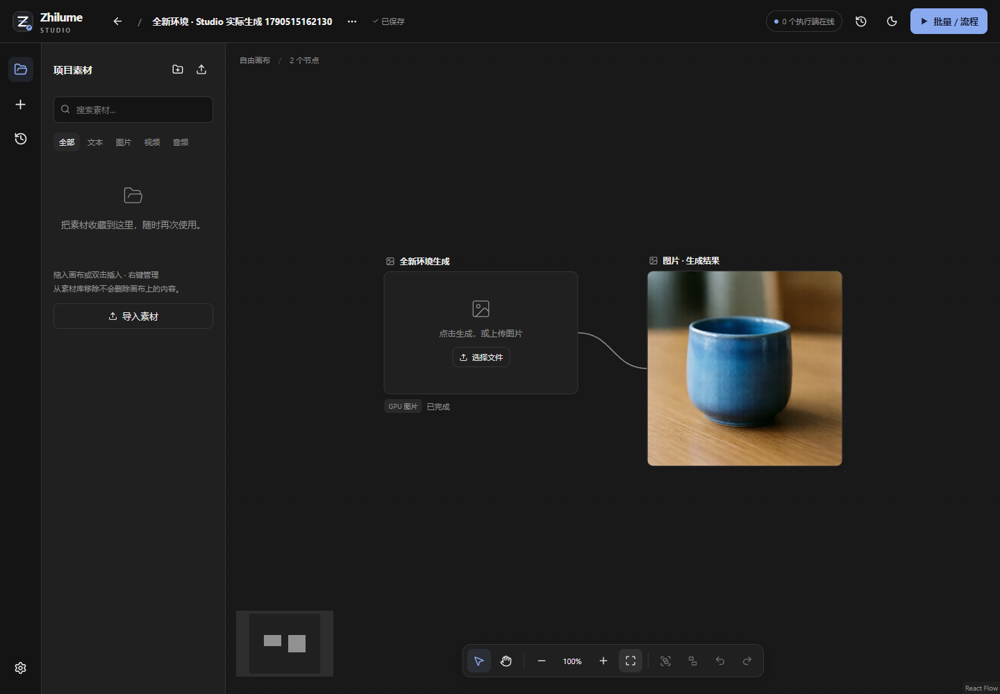

# 全新基础实例部署与 Studio 真实 GPU 联调

2026-09-27 新建上海二 A 5090 / 14 vCPU / 48 GiB / 100 GB SSD 按量实例，使用平台 `cuda132_python312` 基础容器。与 [已有宿主上的新环境 GPU 验收](worker-standard-gpu-acceptance-2026-09-27.md) 分开记录；没有重装原实例。

## 实际宿主与准备

现场检测为 Ubuntu 22.04.5、glibc 2.35、Python 3.10.12，缺 Git、uv、FFmpeg。镜像名称中的 Python 字样不能代替实际解释器检查。显式安装系统工具、uv 0.12.19 和独立 Python 3.12.14 / 3.11.16，没有替换系统 Python。

原 Ubuntu 源下载缓慢；阿里镜像返回 403，直连与代理路径均失败。USTC 源签名索引正常，切换该专用测试实例的源后安装成功，原配置保留备份。没有关闭签名检查，没有把镜像源或代理写入 Worker 代码。可重复步骤见 Worker [Ubuntu 宿主准备](https://github.com/woniu101/zhilume-worker/blob/main/deploy/ubuntu-host.md)。

## 部署结果

| 验收项 | 结果 |
| --- | --- |
| 发布 wheel 全新核心安装 | 通过；最初不含 Torch / Pillow |
| 无 Server 绑定访问管理 API 与静态页面 | 通过；部署不需要 Node.js |
| 0.10 → 0.11 升级、回退、运行中切换保护 | 通过，身份及凭证保持一致 |
| Linux 管理与进程专项 | 16/16，包括子进程清理、取消启动、端口占用、权限及故障隔离 |
| ComfyUI 标准安装 | 固定代码/哈希锁，87 个包一致性与基础导入通过；Python 3.12.14 |
| IndexTTS 标准安装 | 固定代码及上游锁，142 个包一致性与基础导入通过；Python 3.11.16 |
| 公共模型软链接 | 只链接 Qwen 2512 三个实际组件，现场 SHA-256；不下载权重 |
| Worker 服务管理 | 独立 state，Supervisor 单个 Worker 进程，托管 ComfyUI 单独显式启动 |

两种安装最终仍为 `installed-unchecked`：这是安装状态，不会自动表示本机所有模型已推理验证。此后只为图片校验明确给核心安装 Pillow；核心仍未安装 Torch。IndexTTS 的新基础实例 GPU 尚未执行，其真实 GPU 验收在之前的新独立环境完成。

## Studio 实际生成与重新打开

使用真实浏览器和真实三端服务，未拦截生成接口或伪造模型结果：

1. Server 通过操作者临时验收连接接入这台全新 Worker，发现 Qwen 2512 规格。
2. Studio 单击空图片节点，输入提示词，点击提交；512×512 / 5 步任务由 Server 调度。
3. Worker 运行新安装的 ComfyUI；Server 拉回 PNG，核对 SHA-256 后归档。
4. Studio 创建结果节点并保存画布，图片实际解码尺寸 512×512；输出 318,214 字节。
5. 云端关闭后，从独立验收 Server 数据重新打开画布，结果节点和图片仍可显示；没有再次提交 GPU 任务。

首次浏览器尝试在定位项目入口时超时，尚未提交 GPU 任务，记录保留。增加错误采集及复跑时的连接更新后，第二次完成；没有放宽原成功断言。验收截图关闭任务侧栏并适应全部内容，避免结果节点在视口外影响查看。

## 收尾与边界

- 停止 Worker 后显存为 2 MiB，没有残留安装器或推理进程。实例最终确认 Stopped，临时自动关机计划已移除，程序环境与验收数据保留；尚未制作或发布云镜像。停止 GPU 不代表存储免费，本次创建报价中系统盘为 0.02 元/小时。
- 临时 SSH 转发只是操作者验收链路，测试结束关闭；未给产品添加隧道、组网或中继。公网转发的不稳定记录见此前 GPU 验收，不把临时路径通过当成公网通过。
- 新基础实例本轮只运行 Qwen 2512 GPU；H3 / IndexTTS 的目标 GPU 证据来自之前的全新独立环境。没有宣称这台实例所有模型均实测。
- 多物理 GPU、其他云平台、自有 Linux/WSL2 GPU、原生 Windows 推理、完整 Electron 原生联调与可发布镜像仍不在本轮通过范围。

机器可读证据见 [JSON](worker-fresh-host-evidence-2026-09-27.json)。真实 Studio 复测入口为 Server `scripts/accept-studio-gpu.mjs --execute`，使用独立验收数据目录及环境变量传入 Worker 地址与两类凭证；与 Studio 仓库同级放置并安装开发依赖，使用本机空闲 5412 端口。该脚本会执行真实 GPU 生成，不自动购买/关闭云实例。
